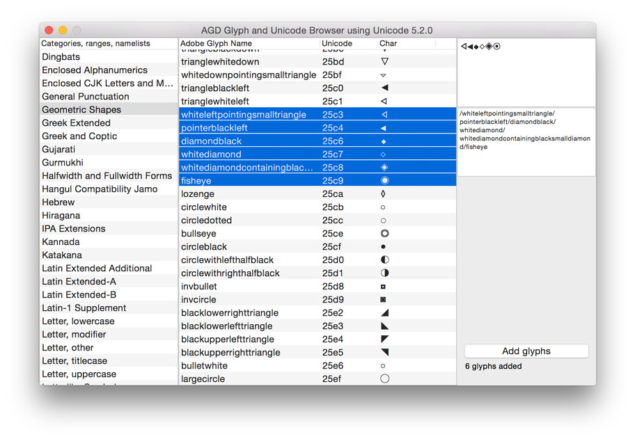

# glyphBrowser

A sketch for a RoboFont extension for browsing and selecting unicode values, glyphnames, categories, lists.
This combines glyphnames from the Adobe AFDKO (https://github.com/adobe-type-tools/afdko/blob/master/FDK/Tools/SharedData/FDKScripts/agd.py) with the unicode categories and range information. A preview of the unicode character is drawn by OSX.

## To do:

  * Solve the dependency on the AGD.txt more elegantly
  * Better preview of the glyphs in the list
