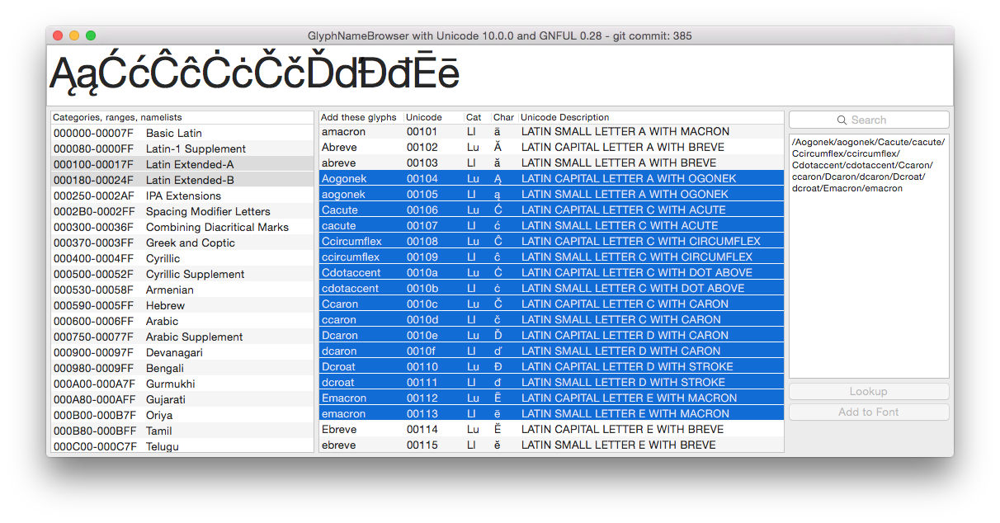

# Glyph(Name)Browser

“Helping Unicode characters to become RoboFont glyphs”

A RoboFont extension for browsing and selecting unicode values, glyphnames, categories, lists. The name list is generated by the [glyphNameFormatter](https://github.com/LettError/glyphNameFormatter) project. Work on GlyphNameFormatter is in continuous so things may change.

* Add selected names to the currently open font.
* Look up individual characters.
* Paste Unicode text and extract a character list.

## New:

* Unicode 11.0.0
* Drag & drop UFO, otf or ttf to the main names list and their unicode values will be used to select names.
* More support for Unicode ranges
* Large preview of selected characters
* Shows Unicode categories for more characters

## Problems?

* If you find a problem with the interface, the actions in RoboFont, etc. raise an issue here: https://github.com/LettError/glyphBrowser/issues
* if you find a problem with one of the glyph names, would like to see support for a specific range or something like that, please raise an issue here: https://github.com/LettError/glyphNameFormatter/issues
